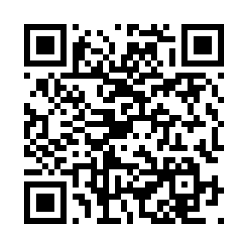

# Once a Wanderer's Contribution - Simple Profile

## எளியவர்களின் முயற்சி

A free, open-source desktop application for generating and visualizing **Market Profile** charts for Nifty Futures (and other instruments).

  

---

## What is Market Profile?

Market Profile is a charting technique developed by J. Peter Steidlmayer at the Chicago Board of Trade. It organizes price and time data to show where the market spent the most time (Point of Control), the Value Area (where ~68% of trading occurred), and the structure of price acceptance/rejection throughout the session.

---

## Features

- **Multiple Modes**
  - Single Day Profile
  - Composite (date range or multi-select)
  - Continuous (last N days side-by-side)
  - Continuous Weekly (last N weeks, configurable week start day — ideal for Nifty expiry cycles)

- **Profile Styles**
  - Merged (stacked TPO count)
  - Expanded (time x-axis with bracket letters A, B, C...)

- **Key Levels & Overlays**
  - POC (Point of Control) — highlighted in yellow
  - VAH / VAL (Value Area High / Low) with shading
  - Open / Close markers
  - Mid Point line
  - Initial Balance (IB) High & Low — configurable duration (default: first 1 hour)

- **Candlestick Chart**
  - TradingView Lightweight Charts integration
  - Multiple timeframes: 1min, 5min, 15min, 30min, 1hour, 4hours, 1day
  - Toggle on/off independently

- **Interactive Canvas**
  - Pan (drag on plot area)
  - Stretch price axis (drag on Y-axis)
  - Stretch time axis (drag on X-axis)
  - Zoom (mouse wheel)
  - Double-click to fit view
  - Crosshair with tooltips

- **Count Metrics**
  - TPO (bracket-based)
  - Minute density (1-min bar based)

- **Settings Dialog**
  - All parameters configurable (tick size, bin size, TPO period, Value Area %)
  - Show/Hide individual overlays (POC, VAH, VAL, Open, Close, Mid, IB)
  - IB duration adjustment

---

## Installation

### Prerequisites

- Python 3.10 or higher
- Internet connection (for TradingView Lightweight Charts CDN on first load)

### Install Dependencies

```bash
pip install PySide6 pandas numpy qrcode[pil]
```

### Run

```bash
python app.pyw
```

---

## Data Format

The application reads **1-minute OHLCV CSV files** with the following columns:

```
timestamp, open, high, low, close, volume
```

- `timestamp` — datetime format (e.g., `2024-04-28 09:15:00`)
- Files should be named with date pattern: `YYYY-MM-DD.csv` or `YYYY_MM_DD.csv`
- Place all CSV files in a single folder and point the app to it

**Session hours:** 09:15 — 15:30 (IST, Nifty market hours). Data outside these hours is filtered out automatically.

---

## File Structure

```
OurOwnProfileMaker/
├── app.pyw            # Main application (PySide6 desktop UI)
├── engine.py          # Pure logic — profile computation, no UI dependency
├── chart_unified.py   # Single QWebEngineView: LWC candlestick + Canvas profile
├── donate_qr.png      # UPI QR code for donations
└── README.md          # This file
```

---

## How to Use

1. **Set Data Folder** — Browse to your folder containing 1-min OHLCV CSV files
2. **Select Mode** — Choose Single day, Composite, Continuous, or Weekly
3. **Select Days** — Pick from the list, date range, or let the app pick last N days/weeks
4. **Click Draw Profile** — The profile renders in the chart area
5. **Click Settings** — Adjust parameters, overlays, candlestick options
6. **Interact** — Pan, zoom, stretch the chart like TradingView

---

## Disclaimer

This software is provided **as-is**. It may contain errors and is **not perfect**. It is meant for educational and personal use. Do not rely on it for trading decisions without independent verification.

---

## Credits

- **Developed with [Claude Code](https://claude.ai)** (Anthropic AI) — the entire codebase was written and iterated through AI-assisted development.
- This phase of development was driven by the need and desire of **Kaeswar** — kaeswar@gmail.com

---

## Contribute / Donate

This is **free to use** and **free to enhance**. If you find it useful, please consider contributing:

- **Code contributions** — Fork, improve, send a PR. All enhancements welcome.
- **Financial support** — A small contribution goes a long way in keeping this alive.

**UPI ID:** `kaeswar@oksbi`

Scan with GPay / PhonePe / Paytm:

<p align="center">
  
</p>

---

## License

Free to use. Free to enhance. Free to share. No restrictions.

---

*Built with Python, PySide6, TradingView Lightweight Charts & HTML5 Canvas.*
